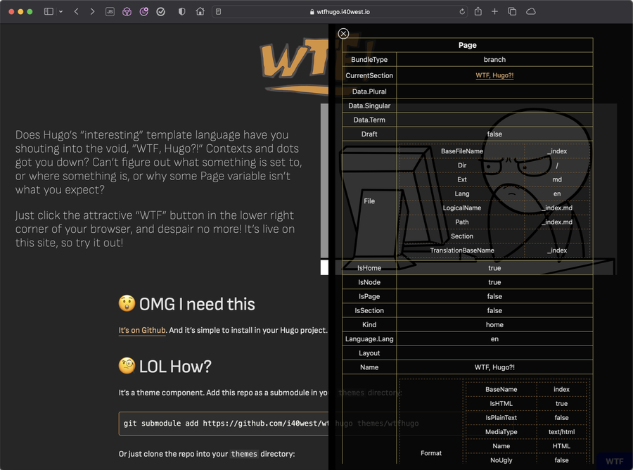

# 🤦🏻‍♂️WTFHugo

How many times have you sat there staring at some Hugo template code,
in Hugo's "interesting" template language, and yelled into the void,
"WTF, Hugo?" Contexts and dots got you down? No idea why some Page
variable isn't what you expect?

What if you could click a button on your site and see all those Page
and Site variables and Params?



This is based on the supremely useful [kaushalmodi/hugo-debugprint](https://github.com/kaushalmodi/hugo-debugprint).
But, it leaves your site design alone and just floats a little "WTF"
button in the lower-right of your browser. Click it, and up pops all
those variables, as they were when the current page was built. Click
the close button to dismiss the pop-up.

## 🤓 How to use it

> [!IMPORTANT]
> WTFHugo has been updated for changes in Hugo 0.123 and will no longer
> work with earlier versions.

It's a theme component. Add this repo as a submodule in your `themes` directory:

```bash
git submodule add https://github.com/i40west/wtfhugo themes/wtfhugo
```

Or just clone the repo into your themes directory:

```bash
git clone --depth 1 https://github.com/i40west/wtfhugo themes/wtfhugo
```

Then, in your site config (`hugo.toml` or `config.toml`), add it as a
theme component along with your site's theme (if you're not using a
theme, just add wtfhugo as the theme):

```toml
theme = [ "wtfhugo", "your-theme" ]
```

Call `wtfhugo` in your site's `<head>`:

```
  {{- partial "wtfhugo.html" . }}
```

And that's it. You can call it conditionally, of course:

```
{{- if and (.Param "WTFHugo") site.IsServer -}}
  {{- partial "wtfhugo.html" . }}
{{- end -}}
```

## 😡 Note

I have been unable to find a way to make `FileInfo` work consistently
anymore, so it's disabled for now. Hugo's template language is a den
of misery, and I'm about done trying to make it not suck.
